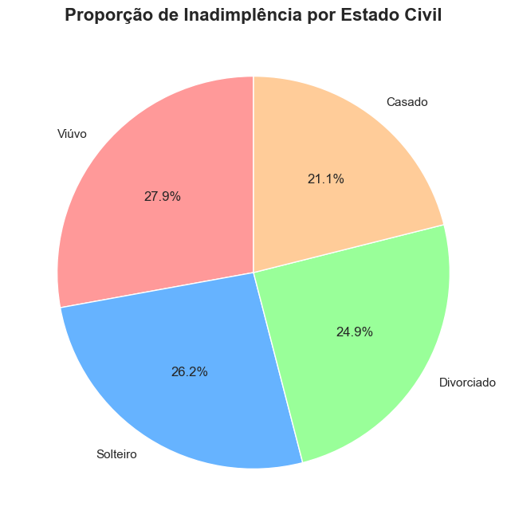
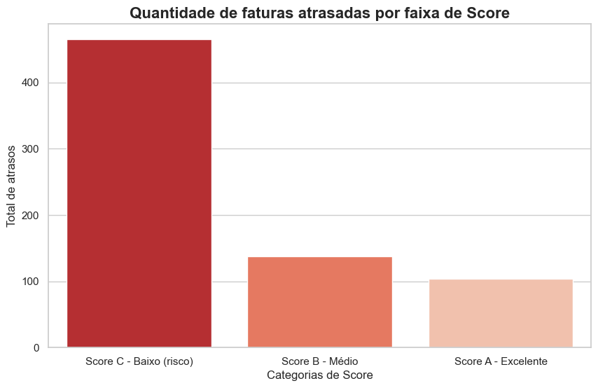
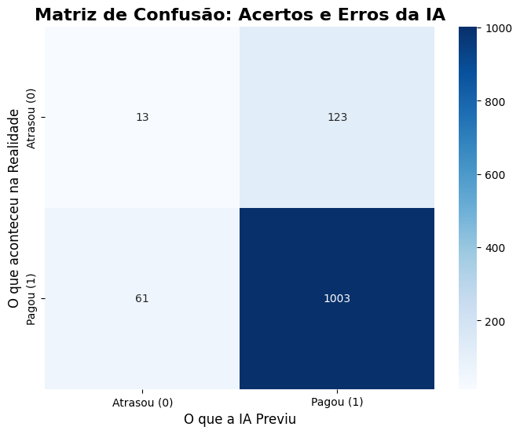
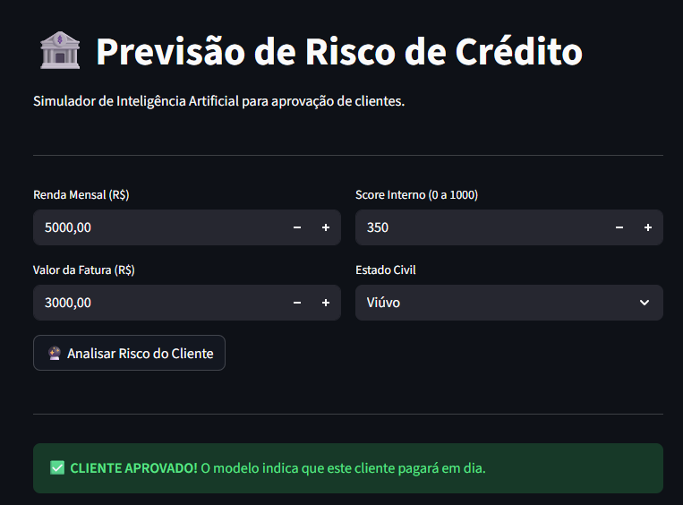

# 🏦 Credit Risk Predictor (Previsão de Risco de Crédito)

## 📌 O Desafio de Negócio
A inadimplência (calote) é um dos maiores causadores de prejuízo para instituições financeiras. O objetivo deste projeto End-to-End (Ponta a Ponta) é analisar o perfil de clientes fictícios, descobrir os padrões que levam ao atraso de faturas e construir um modelo de Inteligência Artificial capaz de prever o risco de crédito de novos clientes.

## 🛠️ Tecnologias e Ferramentas Utilizadas
* **Linguagem:** Python
* **Banco de Dados:** PostgreSQL (Hospedado na nuvem via Render)
* **Manipulação e Engenharia de Dados:** Pandas, SQLAlchemy
* **Análise de Dados:** SQL Avançado (CTEs, JOINs, Agregações)
* **Visualização:** Matplotlib, Seaborn
* **Machine Learning:** Scikit-Learn (Random Forest)

## 📂 As Fases do Projeto

### 1️⃣ Engenharia e Fábrica de Dados
Como não utilizei datasets prontos do Kaggle, criei um simulador em Python para gerar milhares de clientes e faturas fictícias com regras de negócio baseadas no mundo real (ex: clientes com score baixo têm maior probabilidade de calote). Esses dados foram enviados automaticamente para um banco de dados relacional na nuvem.

### 2️⃣ Análise Exploratória com SQL (EDA)
Realizei consultas no banco de dados para responder a perguntas de negócio cruciais:
* Quais são os clientes com o maior número de faturas atrasadas e qual o Score deles? (*Resposta: Os clientes com id 268, 75 e 6 são os que possuem maior quantidade de faturas atrasadas)*
* Quais os meses que possuem a maior quantidade de faturas atrasadas em ordem decrescente? *(Resposta: O mês 6 apresentou maior quantidade de faturas atrasadas)*
* O valor absoluto da fatura influencia no calote? *(Resposta: Não significativamente)*
* Qual estado civil possui a maior quantidade de faturas atrasadas? *(Resposta: O estado civil viúvo apresentou maior quantidade de faturas atrasadas)*
* O peso da fatura no salário do cliente gera inadimplência? *(Resposta: Sim, faturas que consomem mais de 50% da renda são um alerta vermelho)*
* O Score interno é um bom termômetro? *(Resposta: Sim, a maior parte dos calotes vem da faixa de Score C)*

### 3️⃣ Visualização de Dados
Para comunicar os resultados de forma clara, desenvolvi painéis visuais. 

**Proporção de Atrasos por Peso da Fatura no Salário:**
 I]

**Inadimplência por Estado Civil:**                 

**Quantidades de faturas atrasadas por faixa de Score:**                  

### 4️⃣ Machine Learning (O Cérebro do Projeto)
Após preparar os dados (transformando variáveis categóricas com One-Hot Encoding via `get_dummies`), treinei um modelo de **Random Forest (Floresta Aleatória)** para prever futuros calotes.

**Resultados do Modelo:**
* **Acurácia Final:** 84.67%
* O modelo obteve excelente performance para identificar bons pagadores (Recall de 94%).
* **Ponto de Melhoria Identificado:** Devido ao desbalanceamento natural dos dados (muito mais clientes bons do que ruins), o modelo teve dificuldade de identificar caloteiros isolados (Recall baixo para a classe 0). O próximo passo técnico seria aplicar técnicas de balanceamento (como SMOTE) para refinar a IA.

**Matriz de Confusão do Modelo:**                

### 5️⃣ Deploy da Aplicação (O Produto Final)
Para tirar o modelo do ambiente de desenvolvimento (Jupyter Notebook) e transformá-lo em um produto acessível, serializei a Inteligência Artificial utilizando a biblioteca `joblib` (`.pkl`) e construí uma interface web interativa utilizando o **Streamlit**. 
Através dessa interface, é possível simular a entrada de um novo cliente (informando Renda, Fatura, Score e Estado Civil) e receber a previsão da IA em tempo real: **Aprovado** ou **Alerta de Risco**.

**Tela do Simulador em Funcionamento:**

## 💡 Conclusão
Este projeto demonstra domínio completo do ciclo de vida dos dados: desde a concepção e arquitetura no banco de dados, passando por análises estatísticas e regras de negócio com SQL, até a entrega de um modelo preditivo funcional em Machine Learning.
